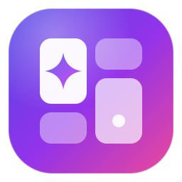
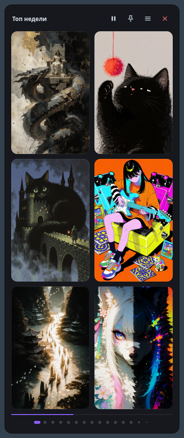

# Civitai Desktop Widget / Виджет трендового AI-арта Civitai



Полупрозрачный десктопный виджет для Linux, который показывает самые популярные работы с [Civitai](https://civitai.com) прямо на рабочем столе.

| Базовый вид | Подпись при наведении | Видео без автовоспроизведения | Zen Mode |
| :---: | :---: | :---: | :---: |
|  |  |  |  |

---

## Возможности

- **Лента Civitai без пропусков**: показываются все работы из ответа API. Когда страницы заканчиваются, следующая порция подгружается сама и добавляется к уже загруженным; пустых плиток не остаётся.
- **Видео**: ролики из ленты проигрываются прямо в плитке, без звука и по кругу. Автовоспроизведение отключается в меню, тогда показывается кадр-постер со значком.
- **Автообновление раз в час**: первая порция обновляется в фоне, галерея при этом не исчезает. Если уже догружено больше, обновление происходит, когда показ доходит до конца.
- **Фильтры**: период (день / неделя / месяц / год / всё время), сортировка, базовая модель.
- **Слайд-шоу**: страницы идут по порядку, интервал 5–120 секунд, пауза сохраняет прогресс. Плитки сменяются по очереди плавным перетеканием старой картинки в новую. Пока курсор над виджетом, страницы не меняются.
- **Адаптивная сетка**: число рядов подстраивается под высоту окна, размер меняется за любой край.
- **Заглушки BlurHash**: пока миниатюра загружается, видна её размытая версия.
- **Zen Mode**: только арт, без панели. Выход — двойной клик, `Esc` или кнопка, появляющаяся при наведении.
- **«Загрузить ещё»** в меню добавляет следующую порцию работ к уже загруженным, не сбрасывая текущую страницу.
- **Клавиатура и колесо мыши**, значок в трее, запуск в одном экземпляре, автозапуск при входе.
- **Настройки сохраняются**: позиция, размер, интервал, фильтры, закрепление, Zen, автовоспроизведение видео.
- **SFW по умолчанию**: фильтр применяется и в запросе, и на клиенте; NSFW включается пунктом меню.
- **Кэш** миниатюр и видео: `~/.cache/civitai_widget/`, не старше недели и не больше 300 МБ; при отсутствии сети показываются сохранённые работы.

---

## Установка

```bash
git clone https://github.com/remyneron/civitai-widget.git
cd civitai-widget
./install.sh
```

Скрипт создаёт виртуальное окружение в `~/.local/share/civitai-widget/venv` (около 400 МБ: Qt и модуль мультимедиа для видео), ставит пакет, команду `civitai-widget` в `~/.local/bin`, иконку и ярлык в меню приложений.

| Команда | Действие |
| :--- | :--- |
| `./install.sh` | Установить или обновить |
| `./install.sh --autostart` | Установить и включить автозапуск |
| `./install.sh --uninstall` | Удалить (настройки и кэш остаются) |

### Требования

- Linux с X11 или XWayland, Python 3.10+
- Для Qt 6.5+ нужна библиотека `libxcb-cursor0` (`sudo apt install libxcb-cursor0`)
- Значок в трее на GNOME требует расширения AppIndicator (в Ubuntu включено по умолчанию)

В сессии Wayland виджет по умолчанию запускается через XWayland: только так окно может запоминать позицию и держаться поверх остальных. Чтобы выбрать платформу самостоятельно, задайте `QT_QPA_PLATFORM`.

---

## Управление

| Действие | Назначение |
| :--- | :--- |
| Клик по карточке | Открыть работу на Civitai |
| Перетаскивание за любое место | Переместить виджет |
| Перетаскивание за край | Изменить размер |
| Двойной клик, `Esc`, `Z` | Zen Mode |
| Колесо мыши, `←` `→`, `PgUp` `PgDn` | Листать страницы |
| `Space` | Пауза |
| `R`, `F5` | Обновить |
| `N` | Загрузить ещё |
| `P` | Поверх всех окон |
| `Ctrl+Q` | Выход |
| Правый клик или кнопка ☰ | Меню со всеми настройками |

---

## Разработка

```bash
python3 -m venv venv
venv/bin/pip install -e ".[dev]"
venv/bin/python -m civitai_widget --debug
venv/bin/ruff check .
QT_QPA_PLATFORM=offscreen venv/bin/pytest
```

```
civitai_widget/
├── app.py         # точка входа, логирование, запуск в одном экземпляре
├── window.py      # окно, жесты, меню
├── card.py        # плитка: картинка или видео, плавная смена
├── widgets.py     # точки пагинации, полоса прогресса
├── slideshow.py   # таймер слайд-шоу с паузой
├── client.py      # сеть: лента, миниатюры и видео (QNetworkAccessManager)
├── feed.py        # фильтрация и пагинация ленты (без Qt)
├── cache.py       # дисковый кэш (без Qt)
├── blurhash.py    # декодер BlurHash (без Qt)
├── config.py      # константы, пути, настройки
├── autostart.py   # автозапуск
├── i18n.py        # строки интерфейса (ru / en)
├── icons.py, styles.py
└── assets/icon.svg
```

Журнал работы: `~/.local/state/civitai-widget/widget.log`. Настройки: `~/.config/civitai-widget/civitai-widget.conf`.

---

## Лицензия

[MIT](LICENSE)
